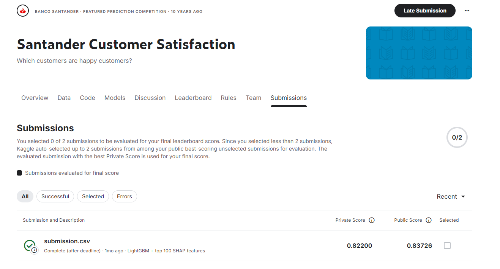
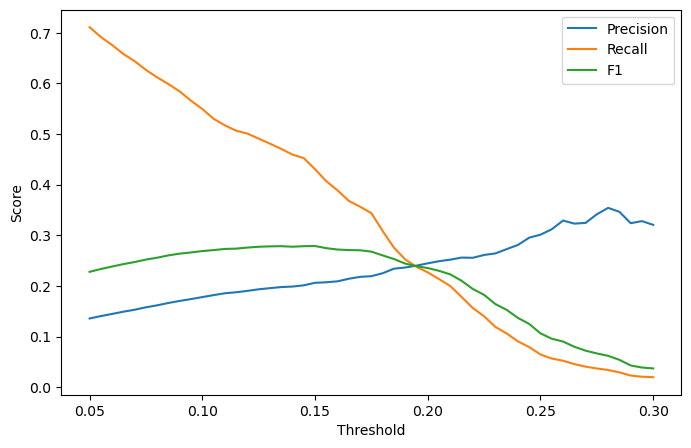

# AutoML Santander Customer Satisfaction Classification

End-to-end binary classification project based on the **Santander Customer Satisfaction** Kaggle competition. The objective is to rank customers by their probability of dissatisfaction (`TARGET = 1`) using anonymized banking features.

The project covers **data auditing, baseline modeling, SHAP-based feature analysis, feature selection, AutoML-assisted model selection, imbalanced-class evaluation, decision-threshold analysis, Kaggle validation, model serialization, and inference-ready serving**.



## Results

| Model / evaluation | ROC-AUC | PR-AUC |
|---|---:|---:|
| Logistic Regression — 5-fold CV | 0.79410 | 0.14352 |
| FLAML best search estimate — LightGBM | **0.83872** | — |
| Final LightGBM — 5-fold CV | **0.83697** | **0.18687** |
| Kaggle Public leaderboard | **0.83726** | — |
| Kaggle Private leaderboard | **0.82200** | — |

The final competition model is **LightGBM using the top 100 SHAP-ranked features**.

Compared with the Logistic Regression baseline, the final LightGBM model improved 5-fold CV ROC-AUC from **0.79410 to 0.83697** and PR-AUC from **0.14352 to 0.18687**.

This was a **prize-awarding Kaggle competition**. The winning private leaderboard ROC-AUC was **0.82907**, while this project achieved **0.82200** — a gap of **0.00707 ROC-AUC (0.707 percentage points)**.


## Data Quality and Feature Analysis

The training set contains **76,020 observations** and the positive class represents about **3.96%** of the data.

The workflow includes:

- removal of **34 constant columns**,
- removal of exact duplicate columns,
- replacement of the `var3 = -999999` sentinel with missing values,
- explicit handling of severe class imbalance,
- SHAP-based feature analysis,
- investigation of suspicious high-importance variables before feature selection.

During the first SHAP analysis, two variables showed implausibly extreme importance values:

- `delta_imp_aport_var33_1y3`
- `delta_num_aport_var33_1y3`

Both contained extremely rare `1e10` values and were perfectly correlated. They were investigated and removed before SHAP importance was recomputed.

## Feature Selection

SHAP-ranked feature subsets were compared using the same Logistic Regression baseline:

| Number of features | ROC-AUC | PR-AUC |
|---:|---:|---:|
| 50 | 0.78806 | 0.13622 |
| **100** | **0.79459** | 0.14409 |
| 150 | 0.79429 | 0.14405 |
| 200 | 0.79436 | **0.14457** |

The **top 100 features** were selected as a compact feature set with the strongest ROC-AUC among the tested subset sizes.

## AutoML Model Selection

FLAML was used with:

- binary classification,
- **ROC-AUC** optimization,
- **5-fold cross-validation**,
- a 10-minute search budget.

FLAML selected **LightGBM** as the best estimator with a best search CV ROC-AUC of:

```text
0.83872
```

Selected LightGBM configuration:

```text
n_estimators      = 145
num_leaves        = 27
min_child_samples = 3
learning_rate     = 0.032989
log_max_bin       = 6
colsample_bytree  = 0.994103
reg_alpha         = 0.013870
reg_lambda        = 0.012052
```

The selected configuration was then evaluated separately with 5-fold cross-validation:

```text
ROC-AUC           0.83697
PR-AUC            0.18687
Accuracy          0.96044
Precision @ 0.50  0.53571
Recall @ 0.50     0.00366
F1 @ 0.50         0.00726
```

The high accuracy is not treated as the main performance indicator because the target is strongly imbalanced.

## Decision Threshold Analysis

The default classification threshold of `0.50` is clearly unsuitable for an operational classifier in this problem: it produces high precision but almost no recall.

Out-of-fold probabilities were therefore evaluated across alternative thresholds using **precision, recall, and F1-score**.



Selected operating points:

| Threshold | Precision | Recall | F1 |
|---:|---:|---:|---:|
| 0.05 | 0.137 | 0.701 | 0.230 |
| 0.10 | 0.181 | 0.537 | 0.271 |
| **0.14** | **0.201** | **0.465** | **0.281** |
| 0.15 | 0.206 | 0.441 | 0.280 |
| 0.20 | 0.245 | 0.228 | 0.236 |
| 0.30 | 0.326 | 0.025 | 0.047 |
| 0.50 | 0.524 | 0.004 | 0.007 |

Within the tested range, the best F1-score was obtained at approximately **0.14**:

```text
Precision = 0.20118
Recall    = 0.46509
F1        = 0.28087
```

This threshold is not presented as universally optimal. In production, the operating threshold should be selected according to the business cost of **false positives versus false negatives**.

The Kaggle competition itself is evaluated by **ROC-AUC**, so leaderboard submissions use probabilities rather than thresholded class predictions.

## What This Project Demonstrates

- tabular data auditing and cleaning,
- constant and duplicate feature removal,
- sentinel-value handling,
- highly imbalanced binary classification,
- Logistic Regression baseline modeling,
- stratified 5-fold cross-validation,
- ROC-AUC and PR-AUC evaluation,
- SHAP-based feature analysis,
- investigation of anomalous features,
- feature-count selection,
- AutoML-assisted model and hyperparameter search,
- LightGBM modeling,
- out-of-fold probability generation,
- precision / recall / F1 threshold analysis,
- Kaggle submission generation,
- unseen leaderboard validation,
- model serialization,
- reproducible inference feature contracts,
- lightweight API-ready prediction logic.

## Repository Structure

```text
automl-santander-classification/
├── README.md
├── requirements.txt
├── .gitignore
│
├── assets/
│   ├── kaggle_submission.png
│   ├── kaggle_prize_winners.png
│   └── threshold_analysis.png
│
├── data/
│   ├── README.md
│   └── raw/
│       ├── train.csv          # not tracked
│       └── test.csv           # not tracked
│
├── notebooks/
│   └── 01_santander_customer_satisfaction.ipynb
│
├── artifacts/
│   ├── README.md
│   ├── model.pkl
│   ├── selected_features.json
│   └── model_metadata.json
│
└── src/
    ├── __init__.py
    ├── inference.py
    └── api.py
```

## Data

Download `train.csv` and `test.csv` from the Santander Customer Satisfaction Kaggle competition and place them in:

```text
data/raw/
├── train.csv
└── test.csv
```

The raw competition data is intentionally excluded from Git.

## Modeling Workflow

```text
Raw Santander Data
        │
        ▼
Data Audit & Cleaning
        │
        ▼
Logistic Regression Baseline
        │
        ▼
SHAP Feature Analysis
        │
        ▼
Suspicious Feature Investigation
        │
        ▼
Top-100 Feature Selection
        │
        ▼
FLAML AutoML Search
        │
        ▼
LightGBM Final Model
        │
        ├── ROC-AUC / PR-AUC
        ├── OOF Probabilities
        └── Threshold Analysis
        │
        ▼
Kaggle Leaderboard Validation
        │
        ▼
Serialized Model + Inference Layer
```

## Setup

Create a virtual environment:

```bash
python -m venv .venv
```

Activate it on Windows:

```bash
.venv\Scripts\activate
```

Install dependencies:

```bash
pip install -r requirements.txt
```

Open the notebook:

```bash
jupyter notebook notebooks/01_santander_customer_satisfaction.ipynb
```

Run the notebook from top to bottom. The final export step creates the inference artifacts under `artifacts/`.

## Inference Artifacts

The notebook contains an export step that generates:

- `model.pkl` — fitted LightGBM classifier,
- `selected_features.json` — exact selected-feature input contract and ordering,
- `model_metadata.json` — model configuration, metrics, decision threshold, preprocessing rules, and package versions.

The stored metadata includes the F1-selected operational threshold of approximately **0.14** together with its precision, recall, and F1 values.

Saving the feature contract together with the model helps reduce **training-serving skew**, where production inputs differ from those used during model development.

## Local Inference

After generating the artifacts:

```python
from src.inference import SantanderPredictor

predictor = SantanderPredictor()

result = predictor.predict_one({
    "var15": 40,
    "var3": 2
})

print(result)
```

The predictor returns the estimated dissatisfaction probability and the threshold-based class decision.

## Optional API

A lightweight FastAPI layer is included to demonstrate how the trained model can be exposed for inference.

Start the service after generating the artifacts:

```bash
uvicorn src.api:app --reload
```

Example request to `POST /predict`:

```json
{
  "features": {
    "var15": 40,
    "var3": 2
  }
}
```

The service returns the predicted dissatisfaction probability together with the threshold-based class decision.

## Methodological Note

Feature selection and model selection were performed on the competition training data. The reported internal cross-validation metrics should therefore be interpreted as **development estimates**, rather than as a fully nested and unbiased estimate of generalization performance.

The **Kaggle private leaderboard ROC-AUC of 0.82200** provides an additional evaluation on labels that were unavailable during model development.

## Competition

**Santander Customer Satisfaction — Kaggle**

- Task: binary classification
- Target: `TARGET`
- Positive class: dissatisfied customer (`TARGET = 1`)
- Competition evaluation metric: **ROC-AUC**
- Project private leaderboard ROC-AUC: **0.82200**
- Winning private leaderboard ROC-AUC: **0.82907**
